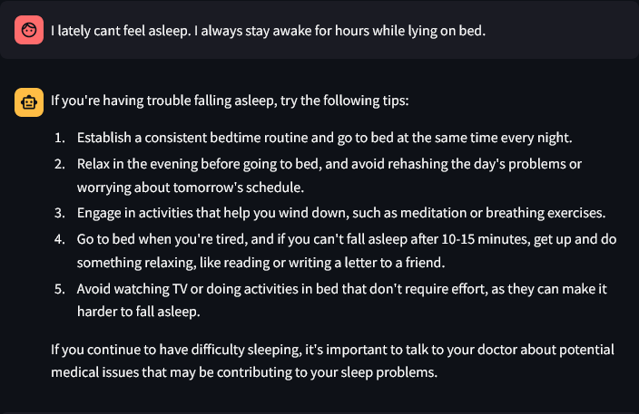
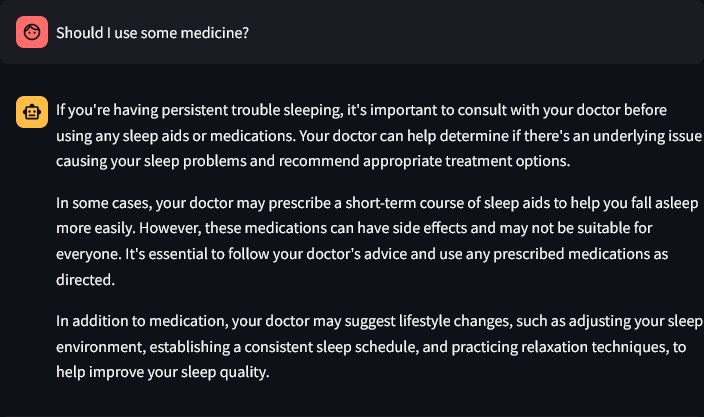
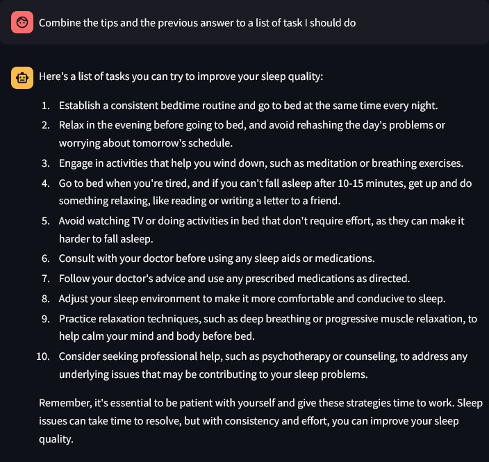

# Doctor LLM

## Description

This is small LLM project using Langchain with RAG and ReAct acting as a Doctor. The RAG use MASHQA dataset as the reference for the model to be better at answering questions.

### Issues

- Model still sometime doesn't follow the rules set by ReAct prompt
- When using with ReAct, RAG sometimes only return question from the vectordb instead of both question and answer. Which result into the final answer being a question instead of an answer toward the user.
- ReAct doesn't work well with smaller model.

## Requirements

- langchain
- langchain-community
- langchainhub
- langchain-openai
- langchain-huggingface
- bs4
- streamlit
- faiss-cpu

## Example





## Running

```
pip install -r requirements.txt

streamlit run app.py 
```

## References

- [MASHQA Dataset](https://drive.google.com/file/d/1ism3N3kMapliaORZQaQU8obNycF8rH9p/view)
- [Openrouter](https://openrouter.ai/)
